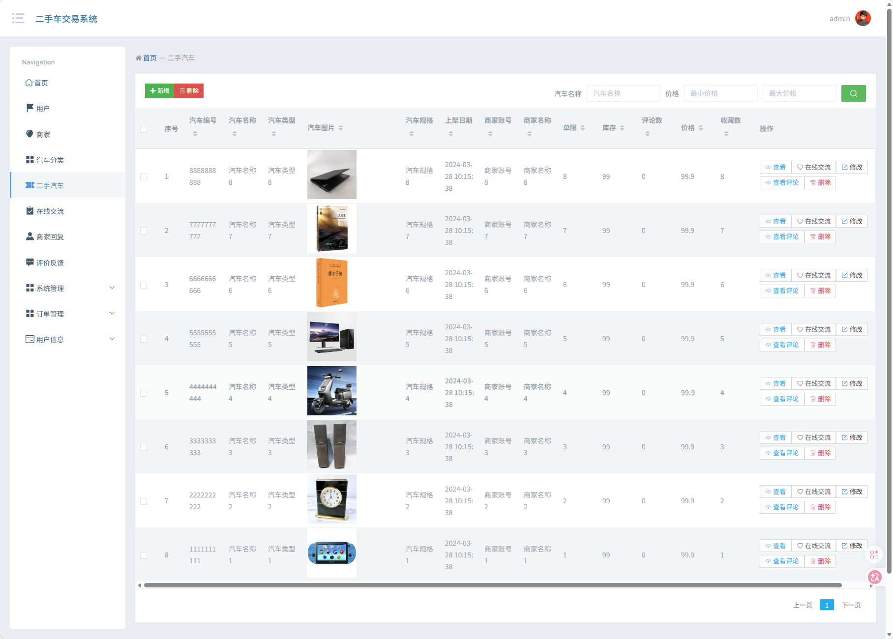
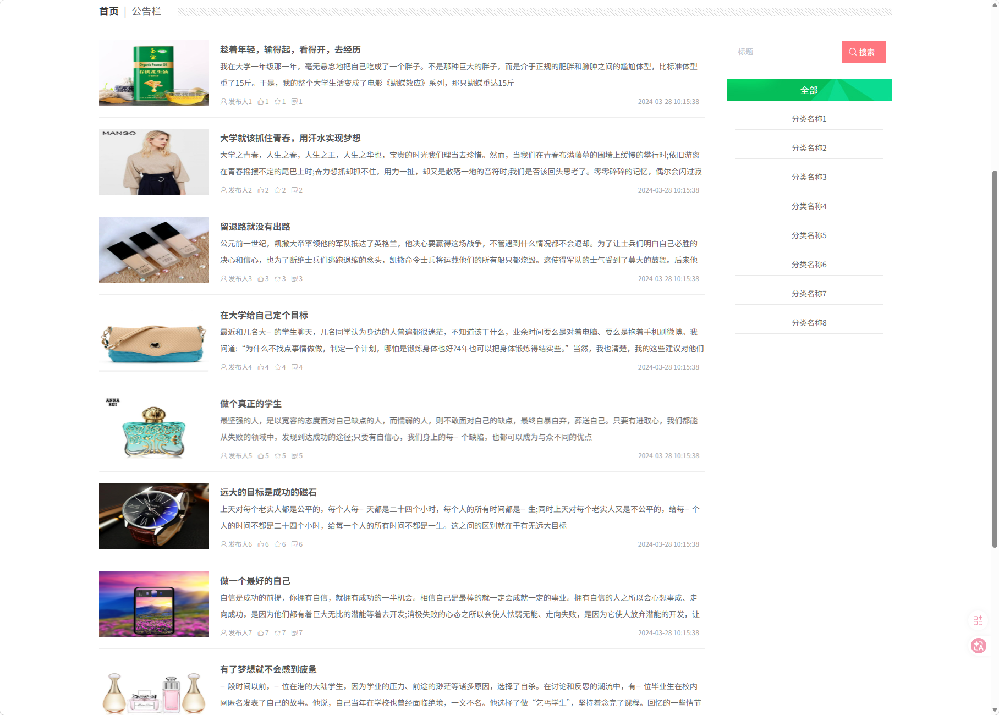

## 🌟 项目简介

这是一个基于 **Java + SpringBoot + Vue + MySQL** 构建的完整二手车交易系统，功能持续优化中...

### 🧩 功能模块一览

- 用户登录 / 注册  
- 用户管理
- 商家管理
- 汽车分类
- 二手汽车
- 在线交流
- 商家回复
- 评价反馈
- 系统管理
- 订单管理
- 用户信息
- 其它...

### 🖼️ 界面预览

|  |  |  |
|--------------------------|--------------------------|--------------------------|
|  |  |  |

---

## ⚙️ 运行环境与工具要求

为了确保项目顺利运行，请确认您的开发环境满足以下条件：

### ✅ 推荐配置
- **Java**: JDK 1.8  
- **MySQL**: 8.0.41  
- **Node.js**: 16.20.2  

⚠️ *温馨提示：版本不一致可能导致依赖冲突或启动失败。*

### 🛠️ 开发工具推荐
- **后端开发**: IntelliJ IDEA 2022+  
- **前端开发**: VS Code  
- **数据库管理**: Navicat / DBeaver / MySQL Workbench  ...

---

## 📲 获取更多帮助和服务

### 🔍 联系我们
关注公众号【斯内普的数字坩埚】即可获取：

- 其它免费的项目程序  
- 远程部署服务和讲解  
- 定制、二开、UI优化
- 微信/QQ 联系方式  

📷 扫码关注👇  

---

